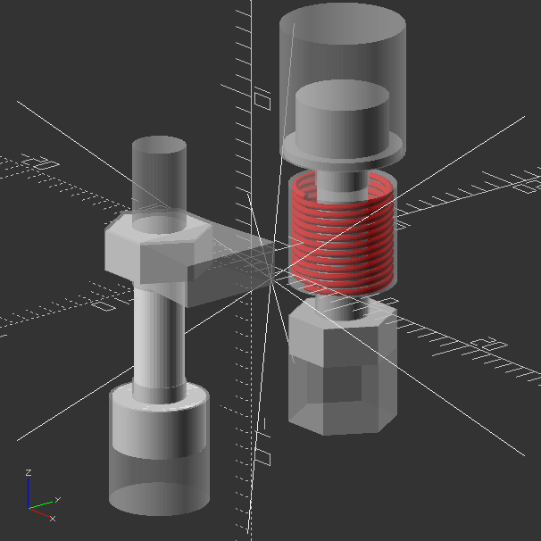

# OptoSCAD
Parametric 3d Printable Opto-mechanics.

Plastic is always going to be second-rate for opto-mech, but it actually can do many jobs so long it's not expected to carry a heavy load, or meet interferometer precision.

This project is about opto-mech as fast and cheap as it can reasonably be.

## Installation

Install OpenSCAD, find your libraries folder.

Clone OptoSCAD from git into the libraries folder. Same goes for NopSCADlib (dependency) [https://github.com/nophead/NopSCADlib](https://github.com/nophead/NopSCADlib).

## Hardware Requirements

* 3d Printer
* stock of screws and nuts (e.g. M3, M4, M6)
* stock of springs (e.g. 6x20x.4 mm and 8x20x.8mm)
* (optional) chop saw
* (optional) metal stock, e.g. 6mm dia (for cages) and 12.7mm dia rod or tubes (for posts) 
* (optional) drill press and taps, i.e. if you want to thread solid rod posts (not required)

## Getting started

The folder OptoSCAD/render has some example .stl files you can open in CAD or a slicer just to get a feel for some of the common variants.

See below under Project status to find links to Thingiverse, which offers 3d views of the same rendered .stl files.

Load customizer from OpenSCAD/cust/*.scad to start customizing a design.

***Catalog of (mostly) working mechanics:***

| Customizer                    |Post|Cage| Notes | Offsite Link |
|-------------------------------|----|----|-------|--------------|
| cust/Adapter Plates.scad        |   |   |       | |
| cust/Adapter Right Angle.scad   |   |   |       | |
| cust/Post Holders.scad          | X |   | untested| [thingiverse](https://www.thingiverse.com/thing:7243131) |
| cust/Post Right Angle Clamp.scad| X |   | untested | |
| cust/Cage Plate.scad            | X | X | needs work | [thingiverse](https://www.thingiverse.com/thing:7243140) |
| cust/Mirror Mount.scad          | X | X | also on HeNe | [thingiverse](https://www.thingiverse.com/thing:7243140) |
| cust/Lens Mount, Focal.scad     |   | X | untested | |
| cust/Lens Mount, XY.scad        |   |   | in planning | |
| cust/Integrating Sphere.scad    |   |   | unreleased; coming soon | |

## Filaments

***Ranked by creep:***

* PLA (worst)
* PETG
* ASA, ABS
* PC (best)

Coincidentally or not, that's the same as sorting by increasing glass transition temperature Tg.

(Where does PA belong, perhaps between PETG and ASA?)

Some say composite filaments are more stable but my impression is the effect of filament filler is rather weak; PA-CF has higher creep and is also softer than PC.

## Project Status

Bringing every form of opto-mech into the project would be a little ambitious.

I'm working on plans for test beds for benchmarks.

***Planned :***

* Lens Mount
* Integrating Sphere
* Robotics

## Hardware Library

There are other hardware libraries out there already, but OptoSCAD includes its own hardware library. Why do that? OptoSCAD's internal hw lib is aimed at forming negatives (pockets) for trapping nuts, counterboring screws (on the low level side) and forming screw/spring adjuster sets and other things (on the high level side), all with 3d printing in mind. Other libraries are more low-level.

Here is a brief demo snippet.

```
include <OptoSCAD/hw.scad>

$fa=2;
$fs=.2;

// SHC and hex nut with pockets
translate([0, -7, 0]) {
    %neg_hex("M3", 1.0, sink=5, capture=true, minor_access=5);
    vit_hex("M3", 1, TLshaft=8);
}
translate([0, -7, -6]) rotate([180, 0, 0]) {
    %neg_boreSHC("M3", 1.0, sink=3);
    vit_SHC("M3", 1);
}

// spring/screw adjuster with SHC and hex nut
// springspec - ["name", OD, wire, free-length, N-coils, isclosed, isflat, 2nd-OD, color]
spring = ["6x20", 6, .4, 20, 12, 1, 0, 0, "red"];
translate([0, 7, 0]) {
    %neg_adjuster_screwnutspring("M3", spring, l_compressed=6, washer=true, typehead=0, typenut=2, overhead=4);
    vit_adjuster_screwnutspring("M3", spring, l_compressed=6, washer=true, typehead=0, typenut=2);
}
```



### More hardware lib demo

Goto the folder OptoSCAD/demo and open of the demo files in OpenSCAD to see demonstrations in more detail. The files hw_pockets.scad and hw_features.scad and hwlookup.scad have additional usage documentation inline.
